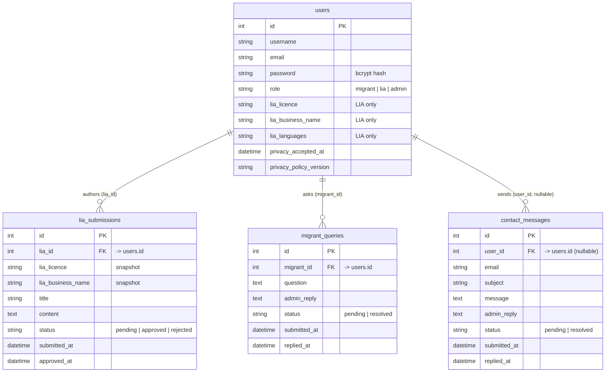

# Database Documentation — Welcomely NZ

This document describes the database used by the Immigration App (Welcomely NZ)
**as currently implemented**. The schema is not stored in a migration or `.sql`
file; it lives directly in the MySQL server. This documentation was
reconstructed from the SQL queries in `app.js` and the connection settings in
`dbConfig.js`. Keep it in sync when the schema changes.

> Recommendations are intentionally kept out of the descriptive sections below
> and gathered in [Recommended Future Improvements](#recommended-future-improvements).

---

## Connection (as implemented)

Configured in `dbConfig.js` using the [`mysql2`](https://www.npmjs.com/package/mysql2) driver
via a single persistent connection (`mysql.createConnection`).

| Setting   | Value               |
|-----------|---------------------|
| Host      | `localhost`         |
| Port      | `3306`              |
| User      | `root`              |
| Database  | `immigrationappdb`  |

On startup the app calls `conn.connect()`, logs success or the failure message,
and exports the connection. The database password is currently hard-coded in
`dbConfig.js`.

---

## Schema Overview

The application uses **four tables**:

| Table               | Purpose                                                        |
|---------------------|----------------------------------------------------------------|
| `users`             | All accounts — migrants, Licensed Immigration Advisers (LIAs), and admins. |
| `lia_submissions`   | Information posts authored by LIAs, moderated by admins.       |
| `migrant_queries`   | Questions submitted by migrants and admin replies.            |
| `contact_messages`  | Public/contact-form messages and admin replies.               |

### Relationships

```
users (id)
  ├──< lia_submissions.lia_id        (one LIA → many submissions)
  ├──< migrant_queries.migrant_id    (one migrant → many queries)
  └──< contact_messages.user_id      (one user → many messages; NULL for guests)
```

These relationships are enforced at the **application layer** via `JOIN`s and
`WHERE` clauses; no database-level foreign-key constraints are visible in the code.

### Entity-Relationship Diagram

> Rendered with [Mermaid](https://mermaid.js.org/) (supported by GitHub and the
> VS Code Markdown preview). Column types are shown as best-effort inferences —
> see [Known Documentation Limits](#known-documentation-limits). The `FK` markers
> denote logical references; they are not enforced by database constraints.



---

## Tables (as implemented)

### `users`

Stores every account. The `role` column distinguishes user types.

| Column                   | Notes                                                               |
|--------------------------|---------------------------------------------------------------------|
| `id`                     | Primary key (auto-increment).                                       |
| `username`               | Login name. Used in `/auth` and as the public LIA profile slug.     |
| `email`                  | Account email.                                                      |
| `password`               | **bcrypt hash** (10 salt rounds). Never stored in plain text.       |
| `role`                   | One of `migrant`, `lia`, `admin`. Compared lowercased/trimmed in app. |
| `lia_licence`            | LIA licence number. Populated only when `role = 'lia'`.             |
| `lia_business_name`      | LIA business name. LIA only.                                        |
| `lia_languages`          | Languages the LIA offers. LIA only.                                 |
| `privacy_accepted_at`    | Timestamp set via `NOW()` at registration.                          |
| `privacy_policy_version` | Privacy policy version accepted (e.g. `'1.0'`).                     |

**Referenced by:** `/auth` (login), `/register`, `/liaRegister`, `/forgotPassword`,
`/resetPassword`, `/lia/:username`, and joins in `/liaInfo`, `/adminReview`,
`/admin/migrantqueries`, `/admin/contactmessages`.

---

### `lia_submissions`

Information posts created by LIAs. Each goes through an admin moderation workflow
(`pending` → `approved` / `rejected`). Only `approved` posts are shown publicly.

| Column              | Notes                                                       |
|---------------------|-------------------------------------------------------------|
| `id`                | Primary key (auto-increment).                               |
| `lia_id`            | References `users.id` (the authoring LIA).                  |
| `lia_licence`       | Snapshot of the LIA's licence at submission time.           |
| `lia_business_name` | Snapshot of the LIA's business name at submission time.     |
| `title`             | Post title.                                                 |
| `content`           | Post body.                                                  |
| `status`            | One of `pending`, `approved`, `rejected`. Inserted as `pending`. |
| `submitted_at`      | Set when the post is created.                               |
| `approved_at`       | Set via `NOW()` when an admin approves the post.            |

**Workflow / referenced by:**
- Create: `POST /liaSubmit` (status `pending`).
- Edit: `POST /liaEdit/:id` — only while `status = 'pending'` and owned by the LIA.
- Delete: `POST /liaDelete/:id` — only while `status = 'pending'` and owned by the LIA.
- Moderate: `POST /approveSubmission/:id`, `POST /rejectSubmission/:id` (admin).
- Display: `/liaInfo` and `/lia/:username` (approved only); `/membersOnly` (LIA's own); `/adminReview` (pending).

---

### `migrant_queries`

Questions migrants ask, with optional admin replies.

| Column         | Notes                                                 |
|----------------|-------------------------------------------------------|
| `id`           | Primary key (auto-increment).                         |
| `migrant_id`   | References `users.id` (the asking migrant).           |
| `question`     | The migrant's question text.                          |
| `admin_reply`  | Admin's reply (empty until answered).                 |
| `status`       | `pending` until answered, then `resolved`.            |
| `submitted_at` | Set when the question is created.                     |
| `replied_at`   | Set via `NOW()` when an admin replies.                |

**Referenced by:**
- Create: `POST /migrantQueries`.
- Migrant view: `GET /migrant/myqueries`.
- Admin inbox: `GET /admin/migrantqueries`.
- Admin reply: `POST /admin/migrantqueries/reply/:id` (sets `admin_reply`, `status='resolved'`, `replied_at`).

---

### `contact_messages`

Messages from the public contact form. `user_id` is `NULL` for non-logged-in (guest) submissions.

| Column         | Notes                                                     |
|----------------|-----------------------------------------------------------|
| `id`           | Primary key (auto-increment).                             |
| `user_id`      | References `users.id`. `NULL` for guests.                 |
| `email`        | Submitter's email.                                        |
| `subject`      | Message subject.                                          |
| `message`      | Message body.                                             |
| `admin_reply`  | Admin's reply (empty until answered).                     |
| `status`       | `pending` until answered, then `resolved`.                |
| `submitted_at` | Set when the message is created.                          |
| `replied_at`   | Set via `NOW()` when an admin replies.                    |

**Referenced by:**
- Create: `POST /contactUs` (works for guests and logged-in users).
- Admin inbox: `GET /admin/contactmessages`.
- Admin reply: `POST /admin/contactmessages/reply/:id` (sets `admin_reply`, `status='resolved'`, `replied_at`).

---

## Known Documentation Limits

The following are **not** determinable from the application code and are not
asserted above:

- Exact column data types, lengths, nullability, and `DEFAULT` values.
- Primary-key/auto-increment definitions (assumed from usage, not confirmed).
- Indexes and unique constraints (e.g. on `username` or `email`).
- Foreign-key constraints (relationships are enforced in app logic only).

To capture the authoritative definitions, run `SHOW CREATE TABLE <name>;`
against `immigrationappdb` for each table and record the output.

---

## Recommended Future Improvements

> These are suggestions only. **No code or schema changes have been made.**
> They are recorded here for future planning.

### Security & configuration
- **Move credentials out of source.** The DB password is hard-coded in
  `dbConfig.js` and committed to git. Move host/user/password/database into
  environment variables (e.g. a `.env` file loaded with `dotenv`) and rotate the
  exposed password.
- **Use a dedicated DB user.** The app connects as `root`. A least-privilege
  account scoped to `immigrationappdb` would limit blast radius.

### Connection handling
- **Use a connection pool.** `mysql.createConnection` opens a single persistent
  connection with no auto-reconnect; a dropped connection breaks all queries
  until restart. `mysql.createPool` handles concurrency and reconnection more
  gracefully.
- **Fail fast on boot.** On connection error the app currently logs and
  continues exporting the connection, so the server starts but queries fail at
  runtime. Consider surfacing the failure at startup.

### Schema integrity
- **Add foreign-key constraints** for `lia_submissions.lia_id`,
  `migrant_queries.migrant_id`, and `contact_messages.user_id` → `users.id`, with
  appropriate `ON DELETE` behaviour (e.g. `SET NULL` for guest-capable
  `contact_messages.user_id`).
- **Use `ENUM` or a lookup table** for `users.role` and the `status` columns
  rather than free-text, to prevent invalid values. (Note the app already
  normalises `role` with `.trim().toLowerCase()`, hinting at inconsistent stored
  values.)
- **Set column-level `DEFAULT`s** — e.g. `status DEFAULT 'pending'` and
  `submitted_at DEFAULT CURRENT_TIMESTAMP` — so defaults don't depend solely on
  the app layer.
- **Add unique constraints** on `users.username` and `users.email` to prevent
  duplicate accounts (login and password-reset logic assume uniqueness).
- **Add indexes** on frequently filtered/joined columns: `users.username`,
  `lia_submissions.lia_id`, `lia_submissions.status`, `migrant_queries.migrant_id`,
  and `contact_messages.user_id`.

### Maintainability
- **Check in the schema.** Add a `schema.sql` (and ideally migrations) to the
  repo so the structure is version-controlled and reproducible, rather than
  living only on the server.
- **Add a password-reset audit/expiry mechanism.** The current
  `/forgotPassword` flow verifies username+email and lets the user reset
  immediately, with no token or expiry recorded in the database.
