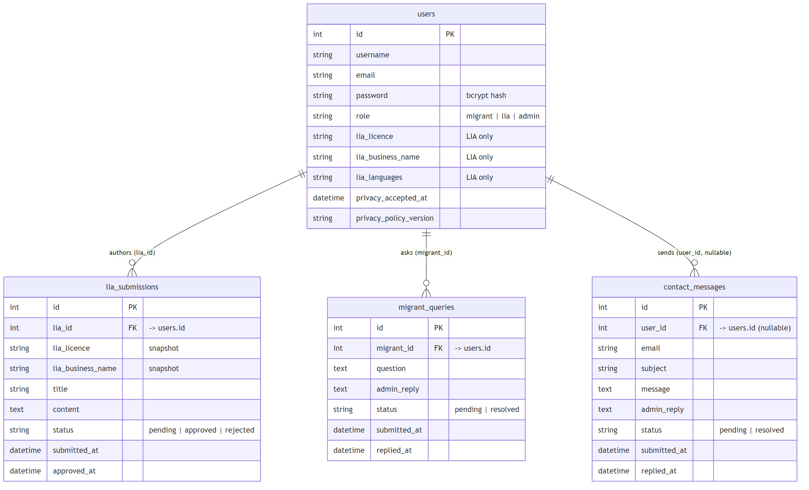

# WelcomelyNZ

A role-based web application designed to help migrants access structured New Zealand immigration information, submit questions, and connect with Licensed Immigration Advisers (LIAs).

WelcomelyNZ was originally developed as a software-development project using Node.js, Express, EJS and MySQL. I later revisited the application to improve its security, configuration and production-readiness while developing my skills in software operations and DevOps.

## Overview

WelcomelyNZ supports three main user roles:

* **Migrants** can register, log in, submit immigration-related questions and view replies.
* **Licensed Immigration Advisers (LIAs)** can create professional profiles and submit information for publication.
* **Administrators** can moderate LIA submissions, manage migrant queries and respond to contact messages.

The project gave me practical experience building a multi-user web application with authentication, role-based access control, database operations and server-side rendering.

## Technology Stack

### Backend

* Node.js
* Express.js
* JavaScript
* MySQL
* `mysql2`
* `express-session`
* `bcrypt`

### Frontend

* EJS
* HTML
* CSS
* JavaScript

### Security and application tooling

* `dotenv`
* `crypto`
* Helmet
* `express-rate-limit`
* Git / GitHub

## Core Features

### Authentication and user roles

WelcomelyNZ supports:

* migrant registration;
* LIA registration;
* secure password hashing with bcrypt;
* session-based login;
* role-based access for migrants, LIAs and administrators;
* protected member-only functionality.

### Migrant functionality

Migrants can:

* register and log in;
* submit immigration-related questions;
* view their previous questions;
* view administrator replies;
* access public immigration information.

### Licensed Immigration Adviser functionality

LIAs can:

* register with licence and business information;
* maintain a public professional profile;
* submit immigration information for moderation;
* edit pending submissions;
* delete pending submissions;
* view the status of their submissions.

### Administrator functionality

Administrators can:

* review pending LIA submissions;
* approve or reject submitted information;
* review migrant questions;
* respond to migrant queries;
* manage public contact messages.

## Screenshots

### Home Page


### Migrant Dashboard


### LIA Profile


### Admin Review Panel


### Database ERD


## Security Improvements

After completing the original application, I reviewed the project from a production-readiness and security perspective and implemented several improvements.

### Environment-based configuration

Database credentials and application secrets were moved out of the source code and into environment variables.

The repository contains an `.env.example` file showing the required configuration structure while the real `.env` file is excluded from version control.

### Password hashing

User passwords are hashed using bcrypt before being stored in MySQL.

Passwords are verified using bcrypt comparison during authentication rather than being stored or compared as plain text.

### Secure password-reset workflow

The original password-reset process was redesigned to use a time-limited, single-use reset-token mechanism.

The current workflow:

1. verifies the account information;
2. generates a cryptographically random reset token using Node.js `crypto`;
3. stores only a SHA-256 hash of the token in MySQL;
4. assigns an expiry time to the reset request;
5. verifies both the token and expiry before allowing a password change;
6. hashes the new password using bcrypt;
7. clears the reset token and expiry after successful use.

During local development, the reset URL is printed to the development terminal. Email delivery is planned as a future enhancement.

### Session hardening

Session configuration was improved by:

* disabling unnecessary session resaving;
* avoiding sessions for uninitialised visitors;
* using HTTP-only cookies;
* applying SameSite cookie protection;
* defining a session expiry period.

Secure cookies will be enabled when the application is deployed behind HTTPS.

### Security headers

Helmet is used to add common HTTP security headers to Express responses.

### Login rate limiting

Authentication requests are rate-limited to reduce exposure to brute-force login attempts.

## Database Design

WelcomelyNZ uses MySQL for persistent application data.

The main application tables include:

* `users`
* `lia_submissions`
* `migrant_queries`
* `contact_messages`

The repository includes additional database documentation in:

```text
DATABASE.md
docs/erd.mmd
docs/erd.png
```

The ERD documents the major entities and relationships used by the application.

## Application Architecture

The current version is a server-rendered Express application.

At a high level:

```text
Browser
   |
   v
Express routes
   |
   +---- EJS views
   |
   +---- authentication / sessions
   |
   +---- application logic
   |
   v
MySQL database
```

The application is currently implemented primarily as a monolithic Express application.

Separating routes, controllers, middleware and database-access logic is a future refactoring objective.

## Running the Application Locally

### Prerequisites

You will need:

* Node.js
* npm
* MySQL

### 1. Clone the repository

```bash
git clone https://github.com/zoesiyinghan-code/welcomely-nz.git
cd welcomely-nz
```

### 2. Install dependencies

```bash
npm install
```

### 3. Configure environment variables

Copy:

```text
.env.example
```

to:

```text
.env
```

and provide your local configuration.

Example:

```env
DB_HOST=localhost
DB_PORT=3306
DB_USER=your_database_user
DB_PASSWORD=your_database_password
DB_NAME=immigrationappdb

SESSION_SECRET=your_generated_session_secret
```

A session secret can be generated with Node.js:

```bash
node -e "console.log(require('crypto').randomBytes(48).toString('hex'))"
```

### 4. Configure the database

Create the MySQL database and tables described in:

```text
DATABASE.md
```

### 5. Start the application

```bash
node app.js
```

The development application currently runs at:

```text
http://localhost:3001
```

## Project Development Journey

The initial goal of WelcomelyNZ was to practise full-stack software-development concepts in a real domain I understand professionally.

After completing the first working version, I returned to the project to evaluate it from a different perspective:

> What would need to change if this application were moving from a student development environment toward a production environment?

That review led to improvements in:

* secrets management;
* dependency management;
* Git repository hygiene;
* password-reset security;
* session security;
* HTTP security headers;
* authentication rate limiting.

This second phase has also become a practical way for me to develop DevOps and software-operations skills using an application I already understand.

## Current Development Focus

My current learning focus is extending the project beyond application development into infrastructure and deployment.

Planned work includes:

* Linux command-line administration;
* Docker containerisation;
* application deployment;
* environment configuration across development and production;
* logging and monitoring;
* database connection pooling;
* automated testing;
* CI/CD;
* improved application architecture.

## Future Improvements

Potential future improvements include:

* transactional email delivery for password-reset links;
* CSRF protection;
* stronger registration input validation;
* centralised error handling;
* structured application logging;
* MySQL connection pooling;
* reusable authentication and role middleware;
* separation of routes, controllers and data-access logic;
* automated test coverage;
* Docker-based development and deployment;
* HTTPS production configuration;
* CI/CD pipeline.

## What I Learned

This project has helped me develop practical experience in:

* translating business requirements into application workflows;
* relational database design;
* SQL queries and CRUD operations;
* authentication and password security;
* session-based access control;
* server-side rendering;
* role-based application design;
* debugging across application and database layers;
* Git and version-control hygiene;
* reviewing an existing application for security and maintainability;
* thinking beyond writing code toward how software is configured, secured, deployed and operated.

## Author

**Zoe Han**

This project is part of my ongoing transition into broader software-development, data and DevOps capability while building on my existing professional experience.
